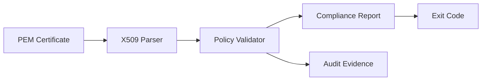

# CertGuard Engine


CertGuard Engine is a policy-as-code PKI gate for X.509 certificates.
It runs security validation in CI and emits audit evidence artifacts.

## In 30 seconds

```bash
python3 -m venv venv
source venv/bin/activate
pip install -r requirements.txt
python src/main.py --cert tests/certificates/valid_cert.pem
```

JSON output:

```bash
python src/main.py --cert tests/certificates/valid_cert.pem --output json
```

## How It Flows



## Implemented Security Controls

- Policy-as-code validation: `policies/*.yaml` + optional Rego (`policies/rego/validity.rego`)
- CI compliance gate: `.github/workflows/compliance.yml`
- SAST/SCA: `.github/workflows/security-scans.yml`
- Code analysis: `.github/workflows/codeql.yml`
- Secret detection: `.github/workflows/secrets-scan.yml`
- IaC scan (Kubernetes manifests): `.github/workflows/iac-scan.yml`
- Keyless provenance signing (OIDC + Rekor): `.github/workflows/compliance.yml`
- API TLS posture checks: `--mode apisec`
- Controlled exceptions: `--waiver-file` (ticket + expiry required)

## Evaluate Exit Codes

- `0`: compliant and no lint failure
- `1`: only low-severity policy failures
- `2`: medium/high failures or lint-only failure
- `3`: critical policy failure

## Risk-Based Gating

- `critical` or `high/medium` failures block merge readiness (`exit 2/3`).
- low-severity-only failures are isolated (`exit 1`) for targeted remediation.
- time-bound exceptions are supported via waiver files with ticket and expiry requirements.

## Current Scope

- In scope: certificate policy validation, CI security gates, IaC manifest checks, API TLS posture checks.
- Not in scope yet: container image scanning (no container images are built/published in this repo).

## Common Commands

```bash
# Evaluate
python src/main.py --cert tests/certificates/valid_cert.pem

# Triage an existing report
python src/main.py --mode triage --report-input reports/compliance_report.json

# API TLS posture check
python src/main.py --mode apisec --endpoint https://example.com
```

## Modes

- `evaluate`, `triage`, `assure`, `watch`, `heal`, `summary`, `trend`, `apisec`, `signals`

## Inputs

- `--cert` (required for `evaluate`)
- `--policy` (default: `policies/cabf_policy.yaml`)
- `--dcv-attestation`, `--issuance-attestation`, `--waiver-file`, `--issuer-cert`

## Key Outputs

- `reports/compliance_report.json`
- `reports/compliance_report.json.seal`
- `audit_evidence/policy_checks.json`
- `audit_evidence/lint_results.json`
- `audit_evidence/waiver_results.json`
- `audit_evidence/opa_results.json`
- `audit_evidence/evidence_manifest.json`
- `audit_evidence/compliance_decisions.jsonl`

## Test Evidence in GitHub

- PR checks: `Compliance Gate` publishes a `Pytest Results` check from JUnit XML.
- Run artifacts: download `certguard-compliance-artifacts-<run_id>` to get:
  - `pytest-junit.xml`
  - `pytest-report.html` (self-contained HTML report)
- Evidence reports are CI-generated; local `reports/test-results/` is intentionally git-ignored.

## Provenance Verification

- `Compliance Gate` signs `release_provenance.json` with cosign keyless signing only on `push` to `main` (release context).
- `Compliance Gate` also publishes a GitHub native build attestation for `release_provenance.json` on `push` to `main`.
- Both verification paths are backed by the same Sigstore trust foundation (Fulcio/Rekor); the benefit is broader verification UX, not a separate root of trust.
- Evidence bundle includes:
  - `release_provenance.cosign.sig`
  - `release_provenance.cosign.crt`
  - `release_provenance.cosign.bundle`
- Verify with GitHub CLI (recommended for most users):
  - `gh attestation verify reports/release_provenance.json --repo thulisa-n/pki-compliance-gate --cert-identity-regex '^https://github.com/thulisa-n/pki-compliance-gate/.github/workflows/compliance.yml@refs/heads/main$'`
- Verify with cosign + Rekor tooling:
  - `cosign verify-blob --bundle release_provenance.cosign.bundle --certificate release_provenance.cosign.crt --signature release_provenance.cosign.sig --certificate-oidc-issuer https://token.actions.githubusercontent.com --certificate-identity-regexp '^https://github.com/thulisa-n/pki-compliance-gate/.github/workflows/compliance.yml@refs/heads/main$' release_provenance.json`
- The cosign bundle is retained as portability evidence so provenance can be re-verified later without relying on repo-stored keys.
- GitHub-native attestations are visible in the repository **Attestations** tab for release-context runs.

## CI Workflows

- `compliance.yml`
- `security-scans.yml`
- `codeql.yml`
- `secrets-scan.yml`
- `iac-scan.yml`
- `standards-sync.yml`
- `standards-pr-guard.yml`
- `kyverno-policy.yml`
- `docs-render.yml`

Required status checks are enforced via GitHub branch protection/rulesets.

## Repo Map

```text
src/certguard/      core agents + engine
src/main.py         CLI entrypoint
policies/           policy files and profiles
tests/              automated tests
deployments/kyverno/ kyverno policy examples
.github/workflows/  CI/CD workflows
```

## More Docs

- `CONTRIBUTING.md`
- `docs/DEVSECOPS_ALIGNMENT.md`
- `docs/PROJECT_STATUS.md`
- `docs/COMPLIANCE_DEBUG_WALKTHROUGH.md`
- `docs/EVIDENCE_LIFECYCLE.md`
- `docs/KYVERNO_POLICY_REPORTING.md`
