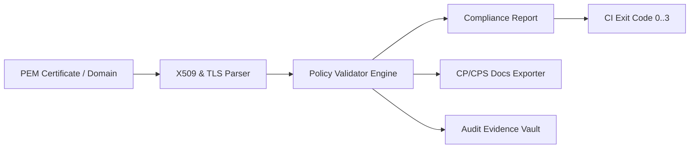

# PKI Compliance Gate (CertGuard Engine)


**PKI Compliance Gate** (CertGuard Engine) is an automated Policy-as-Code engine for X.509 certificates, CA/Browser Forum Baseline Requirements, and API TLS posture governance.

It serves as the **Single Source of Truth** for digital certificate profiles, preventing prose-to-code policy drift and mass certificate revocation events.

---

## ⚡ Quick Start (30 Seconds)

### Option 1: GitHub Action in CI/CD (Recommended)
Add PKI Compliance Gate to your `.github/workflows/compliance.yml`:

```yaml
steps:
  - uses: actions/checkout@v4
  - name: Run PKI Compliance Gate
    uses: thulisa-n/pki-compliance-gate@v1
    with:
      cert: 'tests/certificates/valid_cert.pem'
      policy: 'policies/cabf_policy.yaml'
```

### Option 2: Local CLI Installation
```bash
# Install package
pip install pki-compliance-gate

# Evaluate certificate
pki-gate --cert server.crt --policy policies/cabf_policy.yaml

# Export Single Source of Truth CP/CPS Section 7 Documentation
pki-gate --mode export-cps-doc --policy policies/cabf_policy.yaml --summary-output CPS_SECTION_7.md
```

---

## 🛡️ Key Features

- **Single Source of Truth Policy Engine**: One YAML/Rego profile (`policies/cabf_policy.yaml`) drives pre-issuance linting, CI/CD gates, and auto-generates human-readable CP/CPS Section 7 documentation (`--mode export-cps-doc`).
- **Policy-as-Code Validation**: Enforces max certificate validity (e.g. 90-day/200-day transition), minimum key sizes (RSA >= 2048), prohibited signature algorithms (SHA-1/MD5), and blocked internal domain suffixes.
- **Active API TLS Posture Scanning**: `--mode apisec --endpoint example.com` checks live endpoints for cipher suite security, TLS version compliance, and certificate expiration.
- **OIDC & Keyless Provenance Signing**: Signs compliance reports with Sigstore / Rekor provenance attestation (`release_provenance.json`).
- **Risk-Based Exit Codes**:
  - `0`: Fully compliant
  - `1`: Isolated low-severity warnings
  - `2`: Medium/High severity or lint failures
  - `3`: Critical security violation (blocks merge)

---

## 🔄 How It Flows


```mermaid
flowchart LR
    A[PEM Certificate / Domain] --> B[X509 & TLS Parser]
    B --> C[Policy Validator Engine]
    C --> D[Compliance Report]
    C --> E[CP/CPS Docs Exporter]
    C --> F[Audit Evidence Vault]
    D --> G[CI Exit Code 0..3]
```

---

## 🛠️ Execution Modes

| Mode | Command Example | Description |
| :--- | :--- | :--- |
| `evaluate` | `pki-gate --cert server.crt` | Runs full policy validation on a certificate file. |
| `export-cps-doc` | `pki-gate --mode export-cps-doc` | Compiles YAML policy into CP/CPS Section 7 Markdown documentation. |
| `apisec` | `pki-gate --mode apisec --endpoint example.com` | Scans live domain endpoint for TLS posture and certificate status. |
| `triage` | `pki-gate --mode triage --report-input report.json` | Analyzes compliance findings and prioritizes bug tickets. |
| `assure` | `pki-gate --mode assure --report-input report.json` | Validates audit evidence integrity. |
| `watch` | `pki-gate --mode watch` | Checks policy against external security standards baselines. |
| `heal` | `pki-gate --mode heal --healed-cert new_cert.pem` | Generates remediation plan and evaluates re-issued certificate. |

---

## 📁 Repository Structure

```text
src/certguard/        Core agents, X.509 parser, & engine logic
src/certguard/policy_exporter.py  CP/CPS Single Source of Truth exporter
src/main.py           CLI entrypoint
policies/             Policy YAML profiles & Rego rules
tests/                Automated test suite (83 tests)
.github/action.yml    GitHub Action Marketplace definition file
.github/workflows/    CI/CD workflows & compliance guardrails
```

---

## 📄 License

Licensed under the [MIT License](LICENSE).
