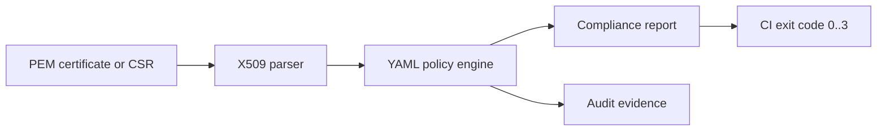

# PKI Compliance Gate (CertGuard Engine)

[](https://github.com/thulisa-n/pki-compliance-gate/actions/workflows/compliance.yml)
[](https://github.com/thulisa-n/pki-compliance-gate/actions/workflows/security-scans.yml)


**PKI Compliance Gate** evaluates an X.509 certificate (or CSR) against a YAML
policy and returns a CI exit code plus evidence. It is not a linter and not a
path validator. Use [zlint](https://github.com/zmap/zlint) for RFC/BR encoding
lint, `openssl verify` for chain and revocation, and this gate for *this
profile in this pipeline*. See [docs/COMPARE.md](docs/COMPARE.md).

One YAML profile is the source of truth for evaluation, CI gating, and
generated CP/CPS Section 7 documentation.

---

## Evaluate a certificate

Pin an immutable release tag (there is no moving `v1` tag). `v0.2.4` is the
current source version.

> **Upgrading from 0.1.x is a breaking change.** Expiry and EC key policy are
> now enforced by default, and the report no longer carries a `score` field.
> See [`CHANGELOG.md`](CHANGELOG.md).

**GitHub Action**

```yaml
steps:
  - uses: actions/checkout@v4
  - name: Run PKI Compliance Gate
    uses: thulisa-n/pki-compliance-gate@v0.2.4
    with:
      cert: path/to/server.crt
      as-of: '2026-09-18'
```

**PyPI**

```bash
python3 -m pip install "pki-compliance-gate==0.2.4"
pki-gate --cert path/to/server.crt --as-of 2026-09-18
```

**Expected reject (not a bug):** this expired fixture used to exit 0, which was
a false negative. It now correctly exits **3** (critical: `certificate_not_expired`).

```bash
pki-gate --cert tests/certificates/expired_cert.pem --as-of 2026-09-18
```

Expected outcomes for every committed PEM live in
[`corpus/verdicts.yaml`](corpus/verdicts.yaml). Same PEM + same policy + same
`--as-of` yields the same `verdict_digest` (see
[`src/certguard/data/compliance-report-2.0.schema.json`](src/certguard/data/compliance-report-2.0.schema.json)).

### Pre-issuance (CSR)

`--csr` checks only what exists before the CA signs (key, SAN, internal names,
PoP signature). Validity, serial, SCT, and path profile are `not_applicable`,
not guessed. Copy-paste examples: [`examples/pre-issuance/`](examples/pre-issuance/).

**Expected reject (not a bug):** this CSR is RSA 1024. The gate must exit **3**
(`rsa_key_size`). Use `tests/certificates/csrs/valid.csr` for an exit 0 demo.

```bash
pki-gate --csr tests/certificates/csrs/weak_key.csr
```

---

## What the default profile enforces

`policies/cabf_policy.yaml`:

- **Validity**: maximum 200 days; certificate must be inside its notBefore/notAfter window.
- **Key material**: RSA >= 2048; ECDSA >= 256 bits on P-256/P-384/P-521 only; RSA and EC are the only permitted algorithms.
- **Signature**: no SHA-1 or MD5; AlgorithmIdentifier allowlist on.
- **Identity**: SAN required; internal DNS suffixes blocked (`.local`, `.internal`, `.intranet`); serial entropy on.
- **Optional overlays** (off by default): DCV attestation, RFC 5280 extension and path profile, HSM/FIPS issuance attestation, crypto-transition targets, SCT presence, EKU profile, OPA/Rego gate, zlint and `openssl asn1parse`.
- **API TLS posture** (`--mode apisec --endpoint example.com`): live TLS version, weak-cipher, expiry and certificate checks.

### Coverage matrix

Every control the engine can emit. A control the active profile does not enable
is reported as `not_applicable` -- defined but **not assessed** -- and is never
counted as a pass.

| Control | Rule ID | Category | Severity | Standard reference |
| :--- | :--- | :--- | :--- | :--- |
| `certificate_expiry_window` | OPS-RENEWAL-WINDOW | VALIDITY | low | Operational renewal policy |
| `certificate_not_expired` | RFC-5280-4.1.2.5 | VALIDITY | critical | RFC 5280 4.1.2.5 / CA/B Forum BR 6.3.2 |
| `certificate_not_yet_valid` | RFC-5280-4.1.2.5 | VALIDITY | high | RFC 5280 4.1.2.5 |
| `crypto_transition_rsa_target` | CRYPTO-AGILITY-RSA | CRYPTO-TRANSITION | medium | Crypto transition readiness profile |
| `crypto_transition_signature_hash` | CRYPTO-AGILITY-HASH | CRYPTO-TRANSITION | high | Crypto transition readiness profile |
| `crypto_transition_validity_target` | CRYPTO-AGILITY-VALIDITY | CRYPTO-TRANSITION | high | Crypto transition readiness profile |
| `dcv_method` | CAB-BR-3.2.2.4 | DCV | high | CA/B Forum BR 3.2.2.4 |
| `dcv_recency` | CAB-BR-4.2.1 | DCV | high | CA/B Forum BR 4.2.1 |
| `ec_curve_allowed` | CAB-BR-6.1.5 | CRYPTOGRAPHY | critical | CA/B Forum BR 6.1.5 |
| `ec_key_size` | CAB-BR-6.1.5 | CRYPTOGRAPHY | critical | CA/B Forum BR 6.1.5 |
| `internal_domain_check` | CAB-BR-7.1.4.2.1 | POLICY | high | CA/B Forum BR 7.1.4.2.1 |
| `issuance_fips_level` | FIPS-140-CONTROL | ISSUANCE | medium | FIPS 140-2/140-3 |
| `issuance_hsm_attestation` | PKCS11-HSM-ATTESTATION | ISSUANCE | high | PKCS#11 / FIPS operations |
| `key_algorithm_allowed` | CAB-BR-6.1.5 | CRYPTOGRAPHY | critical | CA/B Forum BR 6.1.5 |
| `rfc5280_authority_key_identifier` | RFC-5280-4.2.1.1 | RFC5280 | medium | RFC 5280 4.2.1.1 |
| `rfc5280_critical_extension_profile` | RFC-5280-4.2 | RFC5280 | high | RFC 5280 4.2 |
| `rfc5280_end_entity_ca` | RFC-5280-4.2.1.9 | RFC5280 | high | RFC 5280 4.2.1.9 |
| `rfc5280_key_usage_profile` | RFC-5280-4.2.1.3 | RFC5280 | high | RFC 5280 4.2.1.3 |
| `rfc5280_path_aki_ski_match` | RFC-5280-4.2.1.1 | RFC5280 | medium | RFC 5280 4.2.1.1 |
| `rfc5280_path_issuer_subject_match` | RFC-5280-6 | RFC5280 | high | RFC 5280 6.1 |
| `rfc5280_subject_key_identifier` | RFC-5280-4.2.1.2 | RFC5280 | medium | RFC 5280 4.2.1.2 |
| `rsa_key_size` | CAB-BR-6.1.5 | CRYPTOGRAPHY | critical | CA/B Forum BR 6.1.5 |
| `san_extension` | RFC-5280-4.2.1.6 | IDENTITY | high | CA/B Forum BR 7.1.4.2.1 |
| `signature_algorithm` | CAB-BR-7.1.3 | CRYPTOGRAPHY | critical | CA/B Forum BR 7.1.3 |
| `validity_days` | CAB-BR-6.3.2 | VALIDITY | high | CA/B Forum BR 6.3.2 |

### Not covered yet

Stated plainly so the matrix above is not mistaken for full BR conformance.
None of the following are implemented: revocation checking (CRL/OCSP), OCSP
must-staple, chain building and full path validation, CN-in-SAN consistency,
wildcard placement rules, and reserved or internal **IP addresses** in SANs
(only DNS suffixes are checked). SCT presence, EKU profiles, and serial-number
entropy exist as policy controls; SCT and EKU stay **off** on the default
profile.

### Evidence and integrity

Each run writes a compliance report, per-control evidence, and an
`evidence_manifest.json` that records a **SHA-256 digest of every evidence
file**, the engine version, and the digest of the policy bytes that produced
the verdict. The report also carries `verdict_digest`: SHA-256 of the canonical
decision (not the file path). Digests are **not signatures**. Tamper-evident
custody comes from the cosign keyless signature produced in this repository's
CI on `push` to `main`.

### Exit codes

- `0`: no failing checks (and lint not failed)
- `1`: only low-severity check failures
- `2`: medium/high failures, lint failure, or CLI usage/input errors
- `3`: at least one critical check failure

`--fail-on-waived` counts waived findings as failures, for audit runs where an
approved exception must still block.

### Reports carry no percentage score

A single percentage was removed in report schema 2.0. It counted controls the
policy had never enabled, so an almost-empty profile read 100%, and a
certificate failing a *critical* control could still present as ~95%. Reports
now carry `findings` bucketed by severity and a `coverage` block stating how
much was actually assessed:

```text
Compliant: NO
Risk Level: HIGH
Findings: critical=2
Coverage: 12 of 29 controls evaluated (10 pass, 2 fail, 0 waived, 17 not applicable)
```

## How it flows


```mermaid
flowchart LR
    A[PEM certificate or CSR] --> B[X509 parser]
    B --> C[YAML policy engine]
    C --> D[Compliance report]
    C --> E[Audit evidence]
    D --> F[CI exit code 0..3]
```

---

## Advanced modes

The product is `pki-gate --cert`. Everything else is optional.

| Mode | Example | What the code does |
| :--- | :--- | :--- |
| `evaluate` | `pki-gate --cert server.crt` | Full policy evaluation of a certificate or CSR. |
| `export-cps-doc` | `pki-gate --mode export-cps-doc` | Renders the YAML policy as CP/CPS Section 7 Markdown. |
| `export-rego` | `pki-gate --mode export-rego` | Emits an OPA/Rego validity gate from `certificate.max_validity_days`. |
| `apisec` | `pki-gate --mode apisec --endpoint example.com` | Scans a live endpoint for TLS posture. |
| `triage` | `pki-gate --mode triage --report-input report.json` | Turns report findings into severity-ranked next actions. |
| `assure` | `pki-gate --mode assure --report-input report.json` | Independently recomputes whether the report's `compliant` flag matches checks and lint. |
| `watch` | `pki-gate --mode watch` | Diffs the loaded policy against `policies/standards_baseline.yaml`. |
| `heal` | `pki-gate --mode heal --healed-cert new_cert.pem` | Writes a remediation plan; re-evaluates only if `--healed-cert` is provided. |
| `summary` | `pki-gate --mode summary --report-input report.json` | Writes a reviewer Markdown summary. |
| `trend` | `pki-gate --mode trend --report-input report.json` | Writes a trend snapshot JSON. |
| `signals` | `pki-gate --mode signals` | Reads curated external signals JSON and writes recommendations. |
| `readiness` | `pki-gate --mode readiness --as-of 2027-03-15` | Assesses the loaded policy against the dated CA/B validity schedule. |

## Repository structure

```text
src/certguard/          Core engine, CLI, bundled policy, report schema
policies/               Policy YAML profiles; optional generated Rego
corpus/                 Published expected verdicts for committed fixtures
examples/pre-issuance/  CSR / cert-manager / step-ca wiring
tests/                  Automated test suite
action.yml              Composite GitHub Action
```

---

## Distribution status

The GitHub Action, wheel, and sdist are published from the `v0.2.4` tag.
Install the CLI with `pip install pki-compliance-gate==0.2.4`. Later GitHub
releases reuse `.github/workflows/publish.yml` with PyPI trusted publishing
(OIDC, no API token in the repository).

A commercially licensed add-on is maintained privately and is not part of
this repository.

---

## Security

Report vulnerabilities privately: see [SECURITY.md](SECURITY.md). False-positive
findings belong in a GitHub issue using the false-positive template.

## License

Licensed under the [Apache License 2.0](LICENSE).
