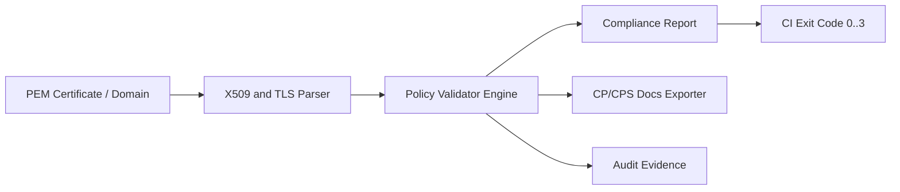

# PKI Compliance Gate (CertGuard Engine)


**PKI Compliance Gate** (CertGuard Engine) is a Policy-as-Code engine for X.509 certificates, CA/Browser Forum Baseline Requirements, and API TLS posture checks.

One YAML policy profile is the source of truth for evaluation, CI gating, and generated CP/CPS Section 7 documentation.

---

## Quick Start

### Option 1: GitHub Action in CI/CD

The published tag is `v0.1.0` (there is no `v1` tag yet).

```yaml
steps:
  - uses: actions/checkout@v4
  - name: Run PKI Compliance Gate
    uses: thulisa-n/pki-compliance-gate@v0.1.0
    with:
      cert: 'tests/certificates/valid_cert.pem'
      policy: 'policies/cabf_policy.yaml'
```

### Option 2: Run from a clone

The package name is reserved in `pyproject.toml`, but it is not published on PyPI. Use the repo locally:

```bash
python3 -m venv .venv
source .venv/bin/activate
pip install -r requirements.txt
export PYTHONPATH=src

# Evaluate a certificate
python src/main.py --cert tests/certificates/valid_cert.pem --policy policies/cabf_policy.yaml

# Export CP/CPS Section 7 documentation from the policy YAML
python src/main.py --mode export-cps-doc --policy policies/cabf_policy.yaml --summary-output CPS_SECTION_7.md
```

---

## What this repo actually enforces

- **Baseline policy** (`policies/cabf_policy.yaml`): max validity **200 days**, RSA >= 2048, no SHA-1/MD5, SAN required, blocked internal suffixes (`.local`, `.internal`, `.intranet`).
- **Optional crypto-transition overlay** (`crypto_transition.*`, disabled by default): target max validity **47 days** and RSA >= 3072 when you opt in.
- **API TLS posture** (`--mode apisec --endpoint example.com`): live TLS version, weak-cipher, expiry, and certificate checks.
- **Keyless provenance in this repository's CI**: on `push` to `main`, `reports/release_provenance.json` is signed with cosign. GitHub native attestations are published only on public repositories.
- **Exit codes from evaluation**:
  - `0`: no failing checks (and lint not failed)
  - `1`: only low-severity check failures
  - `2`: medium/high failures, lint failure, or CLI usage/input errors
  - `3`: at least one critical check failure

---

## How it flows


```mermaid
flowchart LR
    A[PEM Certificate / Domain] --> B[X509 and TLS Parser]
    B --> C[Policy Validator Engine]
    C --> D[Compliance Report]
    C --> E[CP/CPS Docs Exporter]
    C --> F[Audit Evidence]
    D --> G[CI Exit Code 0..3]
```

---

## Execution modes

| Mode | Example | What the code does |
| :--- | :--- | :--- |
| `evaluate` | `python src/main.py --cert server.crt` | Full policy evaluation of a certificate file. |
| `export-cps-doc` | `python src/main.py --mode export-cps-doc` | Renders the YAML policy as CP/CPS Section 7 Markdown. |
| `apisec` | `python src/main.py --mode apisec --endpoint example.com` | Scans a live endpoint for TLS posture. |
| `triage` | `python src/main.py --mode triage --report-input report.json` | Turns report findings into severity-ranked next actions. |
| `assure` | `python src/main.py --mode assure --report-input report.json` | Independently recomputes whether the report's `compliant` flag matches checks and lint. |
| `watch` | `python src/main.py --mode watch` | Diffs the loaded policy against `policies/standards_baseline.yaml`. |
| `heal` | `python src/main.py --mode heal --healed-cert new_cert.pem` | Writes a remediation plan; re-evaluates only if `--healed-cert` is provided. |
| `summary` | `python src/main.py --mode summary --report-input report.json` | Writes a reviewer Markdown summary. |
| `trend` | `python src/main.py --mode trend --report-input report.json` | Writes a trend snapshot JSON. |
| `signals` | `python src/main.py --mode signals` | Reads curated external signals JSON and writes recommendations. |

Optional local API (not a hosted service): `PYTHONPATH=src uvicorn api.server:app --app-dir src`.

---

## Repository structure

```text
src/certguard/          Core agents, X.509 parser, and engine
src/certguard/policy_exporter.py  CP/CPS exporter
src/api/server.py       Optional FastAPI wrapper
src/main.py             CLI entrypoint
policies/               Policy YAML profiles and Rego rules
tests/                  Automated test suite (87 tests)
.github/action.yml      Composite GitHub Action
.github/workflows/      CI workflows
```

---

## License

Licensed under the [MIT License](LICENSE).
